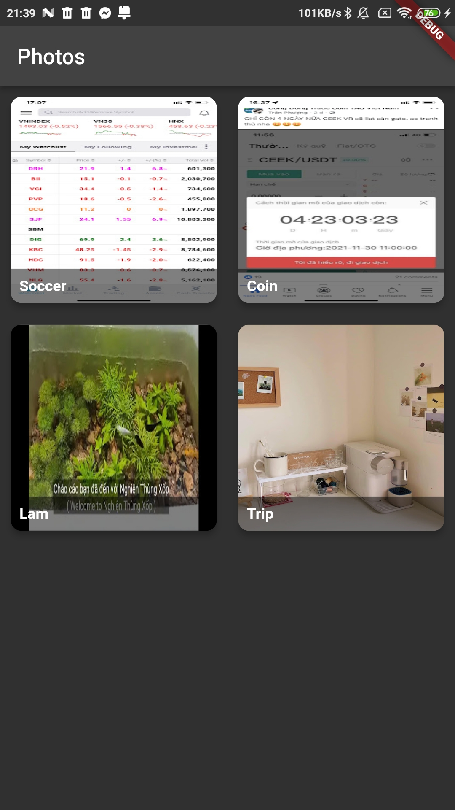
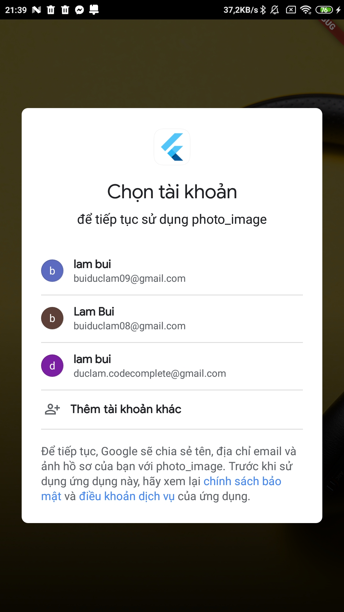
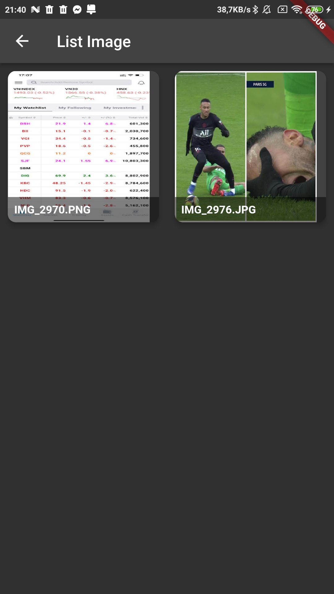
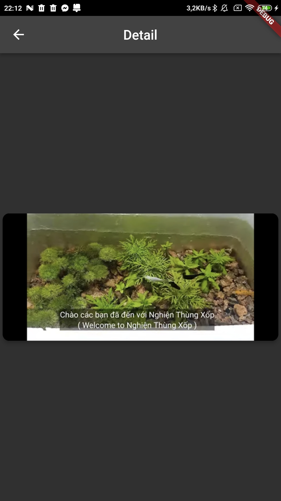

# photo_image

A new Flutter project.
## Getting Started
## Screenshots
| | 
| | 
|
## document:
api:https://developers.google.com/photos/library/guides/overview
The easiest way to call Rest APIs in Flutter: https://medium.com/mindful-engineering/retrofit-the-easiest-way-to-call-rest-apis-is-flutter-fe55d1e7c5c2
This project is a starting point for a Flutter application.
-References:
 + [api:] (https://codelabs.developers.google.com/codelabs/google-photos-sharing#3)
 + [scope:] (https://developers.google.com/identity/protocols/oauth2/scopes)
 A few resources to get you started if this is your first Flutter project:

- [Lab: Write your first Flutter app](https://flutter.dev/docs/get-started/codelab)
- [Cookbook: Useful Flutter samples](https://flutter.dev/docs/cookbook)

For help getting started with Flutter, view our
[online documentation](https://flutter.dev/docs), which offers tutorials,
samples, guidance on mobile development, and a full API reference.
